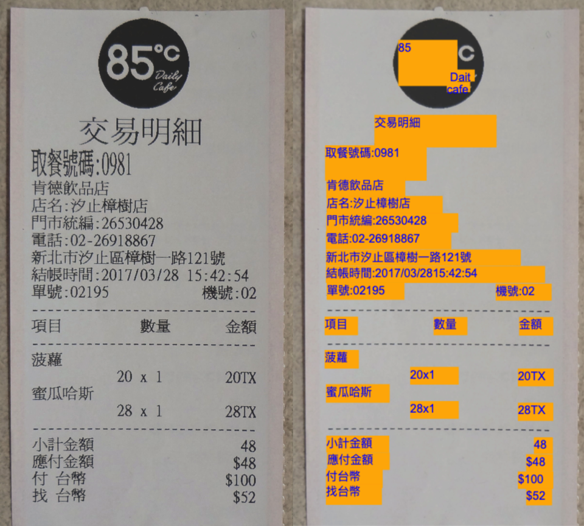
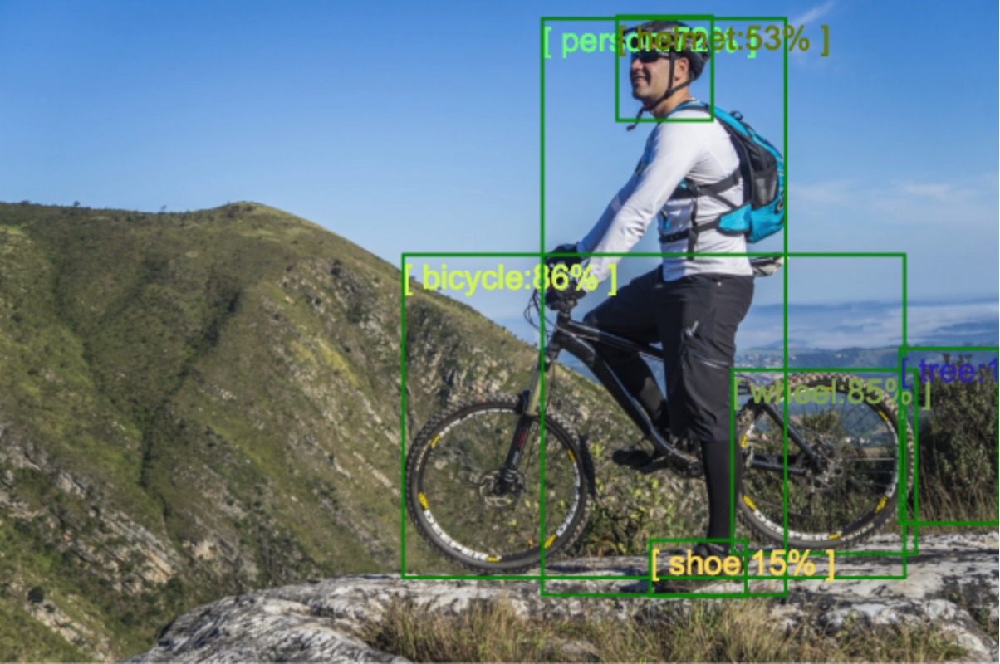
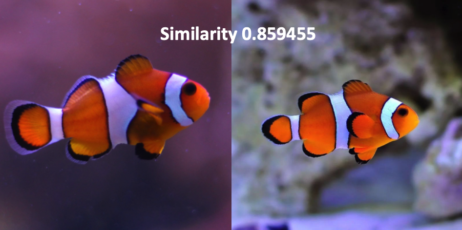
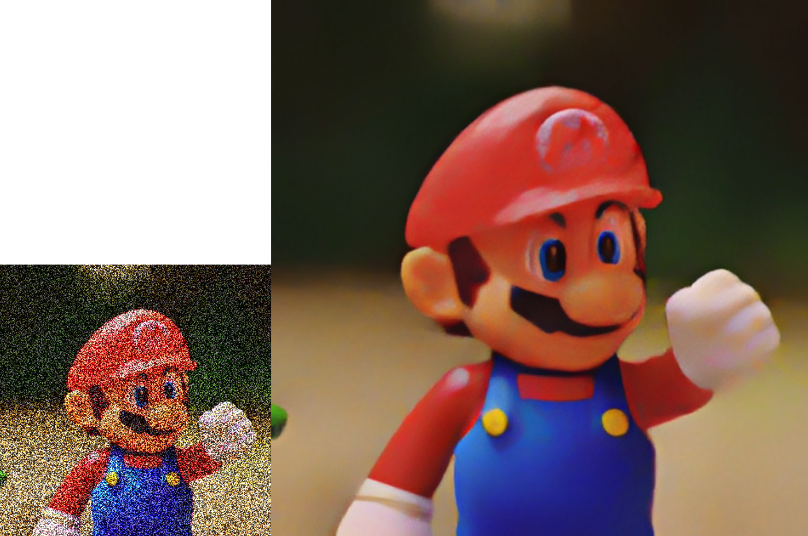
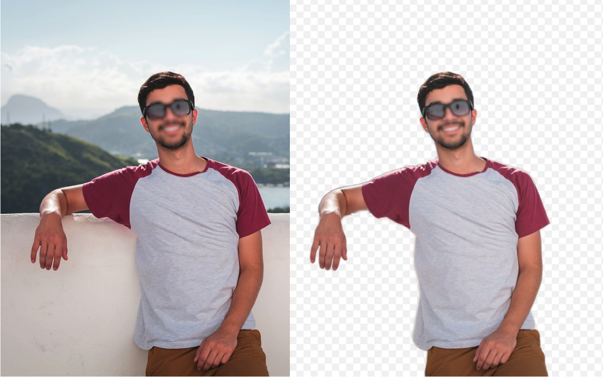
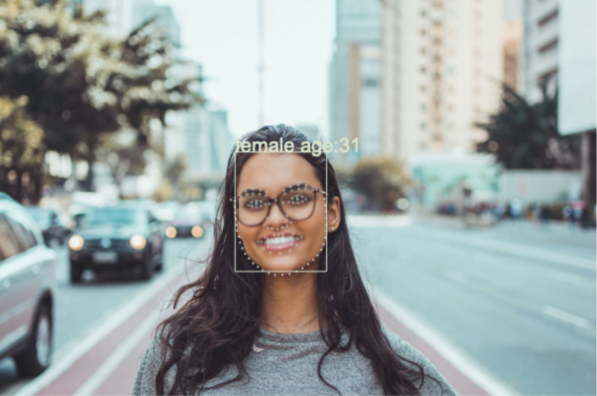
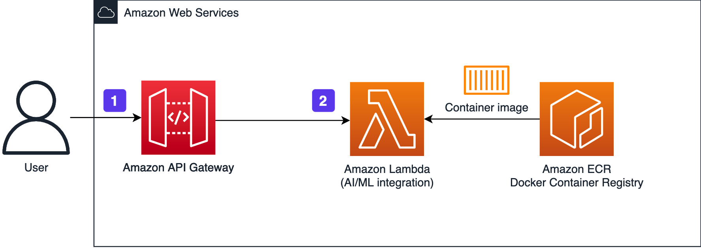
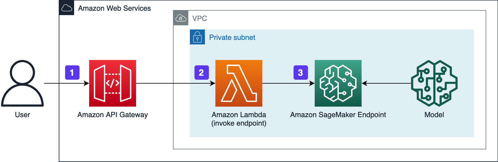

English | [简体中文](README_zh-Hans.md)

<p align="center">
    <h3 align="center">AI Solution Kit</h3>
  </a>
</p>

<p align="center">
  Common Machine Learning Features Kit
</p>

<p align="center">
  <a href="https://awslabs.github.io/aws-ai-solution-kit/en/"><strong>Documentation</strong></a> ·
  <a href="https://github.com/awslabs/aws-ai-solution-kit/releases"><strong>Changelog</strong></a> ·
  <a href="#feature-list"><strong>Feature List</strong></a>
</p>

<p align="center">
  <a href="https://opensource.org/licenses/Apache-2.0"></a>
  <a href="https://github.com/awslabs/aws-ai-solution-kit/actions/workflows/build-template.yml"></a>
  <a href="https://github.com/awslabs/aws-ai-solution-kit/actions/workflows/build-container.yml"></a>
  <a href="https://github.com/awslabs/aws-ai-solution-kit/releases"></a>
</p>

<br/>

## Introduction

This repository contains several pre-trained deep learning models based on AWS Lambda and Amazon SageMaker, for example: general OCR, text similarity, face detection, human image segmentation, image similarity, object recognition, image super resolution (see full list below). By this project, you can download these dockerized modules from Amazon Elastic Container Registry(ECR) and create REST APIs on Amazon API Getaway. Once the project deployed, you can call the REST API to use these features easily.

<div align="center">
    
    
    
    
    
    
</div>

## Feature List

### **Optical Character Recognition(OCR)**
|    **Feature Name**   | **Description**    |
|--------------|-------------|
|General OCR (Simplified Chinese)|Recognize and extract Simplified Chinese, numbers, alphabetical characters and symbols|
|General OCR (Traditional Chinese)|Recognize and extract Traditional Chinese, numbers, alphabetical characters and symbols|
|Custom OCR|Recognize and extract structured text by predefined OCR templates|
|Car License Plate|Recognize text on Chinese car license plate|

### **Facial & Body**
|    **Feature Name**   | **Description**    |
|--------------|-------------|
|Face Comparison|Compare two faces of same person and return a confidence score of the similarity|
|Face Detection|Detect the face in a image and return coordinate information of the face|
|Human Attribute Recognition |Recognize the attributes of the human body in the image|
|Human Image Segmentation|Segment human bodies from background and return the alpha channel|

### **Image Understanding**
|    **Feature Name**   | **Description**    |
|--------------|-------------|
|Image Similarity|Compare two images and return similarity score|
|Object Recognition|Segment human bodies from background and return the alpha channel|
|Pornography Detection|Detect pornographic image in three dimensions (normal, sexy, porn) and return confidence scores|

### **Computer Vision Production**
|    **Feature Name**   | **Description**    |
|--------------|-------------|
|Image Super Resolution|Upscale the resolution and enhance details in the images|

### **Natural Language Understanding(NLU)**
|    **Feature Name**   | **Description**    |
|--------------|-------------|
|Text Similarity|Compare two Chinese words or sentences and return similarity score|


## Quick deployment

This project is an AWS [Cloud Development Kit(CDK)](https://aws.amazon.com/cdk/) project written in Typescript, if you want to use the above deep learning features without building the entire project, you can use the Amazon CloudFormation template to deploy feature APIs quickly, the generated Amazon CloudFormation template is available at: https://aws-gcr-solutions.s3.amazonaws.com/Aws-gcr-ai-solution-kit/v1.2.0/AI-Solution-Kit.template

Below is the quick links to launch the AWS CloudFormation template into your AWS account

Region name | Region code | Launch
--- | --- | ---
Global regions(switch to above region you want to deploy) | us-east-1(default) | [Launch](https://console.aws.amazon.com/cloudformation/home?region=us-east-1#/stacks/create/template?stackName=AI-Solution-Kit&templateURL=https://aws-gcr-solutions.s3.amazonaws.com/Aws-gcr-ai-solution-kit/v1.2.0/AI-Solution-Kit.template)
AWS China(Beijing) Region | cn-north-1 | [Launch](https://cn-north-1.console.amazonaws.cn/cloudformation/home?region=cn-north-1#/stacks/create/template?stackName=AI-Solution-Kit&templateURL=https://aws-gcr-solutions.s3.cn-north-1.amazonaws.com.cn/Aws-gcr-ai-solution-kit/v1.2.0/AI-Solution-Kit.template)
AWS China(Ningxia) Region | cn-northwest-1 | [Launch](https://cn-northwest-1.console.amazonaws.cn/cloudformation/home?region=cn-northwest-1#/stacks/create/template?stackName=AI-Solution-Kit&templateURL=https://aws-gcr-solutions.s3.cn-north-1.amazonaws.com.cn/Aws-gcr-ai-solution-kit/v1.2.0/AI-Solution-Kit.template)

Once the AWS CloudFormation template is opened in your AWS account, you can choose the deep learning features in the **Parameters** section, the step-by-step instruction is available at: https://awslabs.github.io/aws-ai-solution-kit/en/deployment/

## Build from source

You can also build this project from source.

### Prerequisites

- An AWS account
- Configure [credential of aws cli](https://docs.aws.amazon.com/zh_cn/cli/latest/userguide/cli-chap-configure.html)
- Install node.js LTS version, such as v14.x
- Install Docker Engine
- Install the dependencies of solution via executing command 

```shell
yarn install && npx projen
```

- Initialize the CDK toolkit stack into AWS environment(only for deploying via **AWS CDK** first time)

```shell
yarn cdk-init
```

### Deploy project
You can clone this repository to create a local copy on your computer and build this project in root directory by yarn.

- [Optional] Build docker images by yarn and push to an Amazon ECR repository

```shell
yarn build-containers
```

You can push images to an Amazon ECR repository, the step-by-step instructions is available at: https://docs.aws.amazon.com/AmazonECR/latest/userguide/docker-push-ecr-image.html

Once the docker images pushed to Amazon ECR repository, please replace the *ecr registry* in *.projenrc.js* file in project root directory.
```
context: {
    ecrRegistry: 'your-ECR-registry',
}
```

- Build CDK project

```shell
yarn build
```

- Deploy CDK project

*Note* If you do not build docker images, the ECR registry for pre-trained images will use default 'public.ecr.aws/aws-gcr-solutions/aws-gcr-ai-solution-kit' 

Once the project built, you can deploy to your AWS account.

```shell
yarn deploy
```

Once the project deployed, please log in to your AWS console, choose to active deep learning features by updating the Amazon CloudFormation stack. The step-by-step instructions is available at: https://awslabs.github.io/aws-ai-solution-kit/en/deploy-add-delete-api/

## Architecture

This project contains two types of implementation: Building on AWS Lambda and building on Amazon SageMaker.

*Note* The Amazon SageMaker type implementation is only available for image super-resolution feature.

- Building on AWS Lambda



1. Sending API requests to Amazon API Gateway. The request payload needs to contain the processed image or text.

2. Amazon API Gateway sends received user requests directly to AWS Lambda functions.

3. The AWS Lambda function returns the result(JSON format) to the caller.

- Building on Amazon SageMaker



1. Sending an API request to Amazon API Gateway. The request payload needs to contain the processed image or text.

2. Amazon API Gateway sends the request to the AWS Lambda function.

3. AWS Lambda invokes Amazon SageMaker Endpoint, executes the inference in Amazon SageMaker and returns results (JSON format).


## API Reference

See [API Reference](https://awslabs.github.io/aws-ai-solution-kit/en/api-explorer/)

## Authorization and Security

By default, the AI Gateway will enable the IAM authorization and Enable the CloudWatch Logs for accessing and debugging.

## License
This project is licensed under the Apache-2.0 License.
