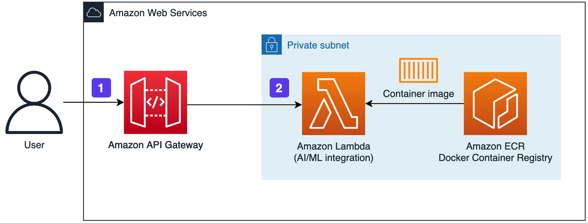
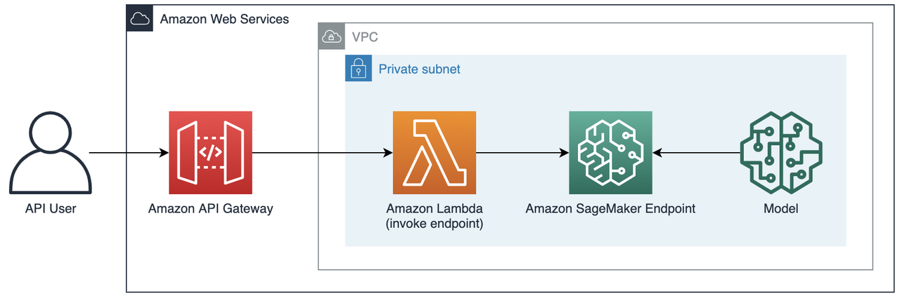

This solution architecture has two types of AI feature implementations: architecture based on AWS Lambda and architecture based on Amazon SageMaker.

!!! Note "Note"
    In release 1.2.0, the architecture based on Amazon SageMaker is only applicable to **Image Super Resolution Solution**.

## Architecture based on AWS Lambda

1. The user or application sends an API request to the Amazon API Gateway. The request payload needs to contain information about the image or text to be processed.

2. Amazon API Gateway sends the incoming user request directly to the AWS Lambda function. 

3. The AWS Lambda function returns the result to the invoker.

## Architecture based on Amazon SageMaker

1. The user or application sends an API request to the Amazon API Gateway. The request payload needs to contain the image or text information to be processed.

2. Amazon API Gateway sends the request to AWS Lambda (invoke endpoint) function.

3. AWS Lambda invokes Amazon SageMaker Endpoint, which performs the inference process in Amazon SageMaker and returns the inference result (usually in JSON format data).
