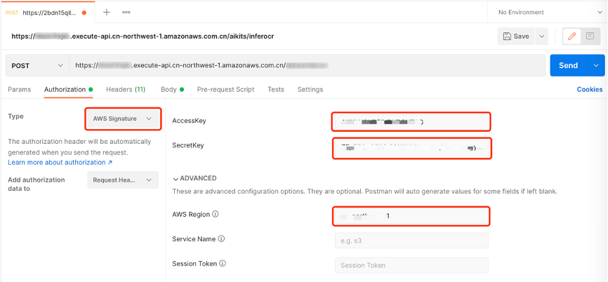
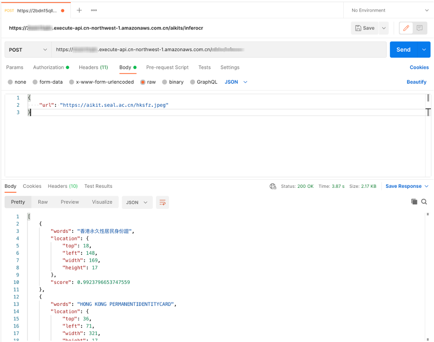

## Background

This deployment guide describes how to deploy **AI Solution Kit - Image Super Resolution** solution by Amazon CloudFormation templates.

The AI and ML driven applications are maturing rapidly and creating new demands on enterprises, the AI Solution Kit provides diversified leading AI/ML solutions that are easy to use. Customers can easily work with the REST API or software development kit (SDK) provided by AI/ML solution. Image Super Resolution solution based on pre-trained networks, super sesolution feature enhancing the resolution of an image from low-resolution to high.

## Solution Description
Once the solution deployed by Amazon CloudFormation template, customers can use this solution feature by calling HTTP (s) or API interfaces, the REST API interface which created by Amazon API Gateway provides customers the AI services and customers can send request (pictures) to the Amazon API Gateway via HTTP POST method, then the Amazon Lambda function is invoked by the Amazon API Gateway, and returns the Base64 encoded Alpha channel image data after super solution.

By using a serverless architecture, such as Amazon Lambda, Amazon API Gateway, serverless works in a pay-as-you-go manner, which means that customers only pay for those resources which they actually use.

## System Architecture
Starting from the API User(s) side, the API user sends an HTTP request to Amazon API Gateway to pass payload parameters. The API Gateway is a layer that provides the RESTful API to the client for the AI applications, in AI Kits solution, there are two types of AI feature implementations: Lambda function and SageMaker.

 - Lambda Integration

The ML models are stored in Amazon EFS, the AI algorithm are implemented in the Lambda function, the Lambda function parses the values from API Gateway and performs model in EFS. After that, it returns a value (JSON format) and sends it back to the API Gateway.

 - SageMaker Integration

The Lambda function (invoke endpoint) parses the value and sends it to the Amazon SageMaker model endpoint, the SageMaker model performs the prediction and returns the predicted value to the Lambda. The same with the Lambda implementations, the Amazon API Gateway subsequently receives the response from the Lambda function and maps it to a response that is sent back to the client.

### Architecture diagram
This solution currently supports deployment in Amazon Web Services standard regions.

 - Lambda Integration


 - SageMaker Integration


### Components

**Amazon API Gateway**

- This solution uses API Gateway to route HTTP requests
- To associate the domain name registered by the ICP
- API Gateway can also set a key to authorize the HTTP POST requester

**Amazon Lambda**

- The Lambda function handles the customer's requests for inference.

**Amazon EFS**

- Amazon EFS stores machine learning models based on Lambda pre-training. Lambda functions perform inference calculations by calling models stored in Amazon EFS and return the results to the caller.

**Amazon SageMaker**

- SageMaker cluster handles customers inference request, the face detection, human body detection and face comparison models are loaded according deployment configuration. Sagemaker endpoints could be configured to auto-scaling according to requests' pattern to support high-concurrency application scenarios.

### Instance Type
Image Super Resolution solution includes two architecture design types based on Lambda functions and SageMaker GPU instances (see System Architecture). When deploying this solution, users only need to choose one of them for deployment according to actual business scenarios.
The Lambda function architecture is designed for serverless architecture, and users only pay for the actual usage.
The SageMaker GPU architecture runs on a managed service based on Amazon SageMaker instances and aims to provide high availability and high-performance real-time inference for use cases that require real-time prediction.

## Automated Deployment
The following deployment instructions apply to solutions deployed in the Amazon Web Services (Ningxia) region operated by NWCD or the Amazon Web Services (Beijing) region operated by Sinnet. You can use the following link to quickly launch an Amazon CloudFormation stack to deploy and manage this solution.

**Time to deploy**: Approximately 15 minutes. 

### Prerequisites (China Region Only)
This solution uses Amazon API Gateway to receive API call requests, so if you want to provide API requests that can be accessed without authentication in the Beijing region, please make sure that your Amazon Web Services account has passed the Internet Content Provider (ICP) for the record, port 80/443 can be opened normally, please refer to [here](https://s3.cn-north-1.amazonaws.com.cn/sinnetcloud/ICP+recordal/ICP%E5%A4%87%E6 %A1%88%E8%AF%B4%E6%98%8E.pdf).

### Sign in to Amazon Web Service console

Sign in to the Amazon Web Service Management Console with the IAM permissions (such as: *APIGatewayInvokeFullAcces*).  Please use [Sign in to amazon.com](https://console.aws.amazon.com) to sign in your Amazon Web Services account, for China region via https://console.amazonaws.cn.

### Launch the stack

Open the Amazon Web Services console and use the Region selector in the console navigation bar to launch this solution in a different Amazon Web Service Region. Then, click the applicable link to launch the solution Amazon CloudFormation template. 

You can also download the template as a starting point for your own implementation. 

| Launch Solution                                                                                                                                                                                                                                               | Description                                        |
| -------------------------------------------------------------------------------------------------------------------------------------------------------------------------------------------------------------------------------------------------------- | ------------------------------------------- |
| [Beijing Region(GPU)](https://cn-north-1.console.amazonaws.cn/cloudformation/home?region=cn-north-1#/stacks/create/template?stackName=AIKitsSuperResolutionGPUStack&templateURL=https://aws-gcr-solutions.s3.cn-north-1.amazonaws.com.cn/Aws-gcr-ai-solution-kit/v1.0.0/AIKits-Super-Resolution-GPU-Stack.template)            |  AI Solution Kits - Super Resolution with Amazon SageMaker GPU Instance |
| [Ningxia Region(GPU)](https://cn-northwest-1.console.amazonaws.cn/cloudformation/home?region=cn-northwest-1#/stacks/create/template?stackName=AIKitsSuperResolutionGPUStack&templateURL=https://aws-gcr-solutions.s3.cn-north-1.amazonaws.com.cn/Aws-gcr-ai-solution-kit/v1.0.0/AIKits-Super-Resolution-GPU-Stack.template)        |  AI Solution Kits - Super Resolution with Amazon SageMaker GPU Instance |
| [Global Regions(GPU)](https://console.aws.amazon.com/cloudformation/home?region=us-east-1#/stacks/create/template?stackName=AIKitsSuperResolutionGPUStack&templateURL=https://aws-gcr-solutions.s3.amazonaws.com/Aws-gcr-ai-solution-kit/v1.0.0/AIKits-Super-Resolution-Inf1-Stack.template)                                  |  AI Solution Kits - Super Resolution with Amazon SageMaker GPU Instance |
| [Global Regions(Inf1)](https://console.aws.amazon.com/cloudformation/home?region=us-east-1#/stacks/create/template?stackName=AIKitsSuperResolutionInf1Stack&templateURL=https://aws-gcr-solutions.s3.amazonaws.com/Aws-gcr-ai-solution-kit/v1.0.0/AIKits-Super-Resolution-Inf1-Stack.template)                                  |  AI Solution Kits - Super Resolution with Amazon SageMaker Inf1 Instance |
| [Beijing Region(Lambda)](https://cn-north-1.console.amazonaws.cn/cloudformation/home?region=cn-north-1#/stacks/create/template?stackName=AIKitsSuperResolutionStack&templateURL=https://aws-gcr-solutions.s3.cn-north-1.amazonaws.com.cn/Aws-gcr-ai-solution-kit/v1.0.0/AIKits-Super-Resolution-Stack.template)            |  AI Solution Kits - Super Resolution with Amazon Lambda |
| [Ningxia Region(Lambda)](https://cn-northwest-1.console.amazonaws.cn/cloudformation/home?region=cn-northwest-1#/stacks/create/template?stackName=AIKitsSuperResolutionStack&templateURL=https://aws-gcr-solutions.s3.cn-north-1.amazonaws.com.cn/Aws-gcr-ai-solution-kit/v1.0.0/AIKits-Super-Resolution-Stack.template)        |  AI Solution Kits - Super Resolution with Amazon Lambda |
| [Global Regions(Lambda)](https://console.aws.amazon.com/cloudformation/home?region=us-east-1#/stacks/create/template?stackName=AIKitsSuperResolutionStack&templateURL=https://aws-gcr-solutions.s3.amazonaws.com/Aws-gcr-ai-solution-kit/v1.0.0/AIKits-Super-Resolution-Stack.template)                                  |  AI Solution Kits - Super Resolution with Amazon Lambda |


| CloudFormation template                                                                                                                                                                       |
| ----------------------------------------------------------------------------------------------------------------------------------------------------------------------------- |
| [AIKits-Super-Resolution-Stack.template](https://aws-gcr-solutions.s3.amazonaws.com/Aws-gcr-ai-solution-kit/v1.0.0/AIKits-Super-Resolution-Stack.template) |
| [AIKits-Super-Resolution-Inf1-Stack.template](https://aws-gcr-solutions.s3.amazonaws.com/Aws-gcr-ai-solution-kit/v1.0.0/AIKits-Super-Resolution-Inf1-Stack.template) |
| [AIKits-Super-Resolution-GPU-Stack.template](https://aws-gcr-solutions.s3.amazonaws.com/Aws-gcr-ai-solution-kit/v1.0.0/AIKits-Super-Resolution-GPU-Stack.template) |

>By default, the template will start after you log in after the default console area. To launch the solution in a designated Amazon Web Service region, please select it from the region drop-down list in the console navigation bar.

On the Specify template page, verify that you selected the correct template and choose Next.


On the Specify stack details page, assign a name to AI Solution Kit - Image Super Resolution in the Stack name field.

Under **Parameters**, review the parameters for the template, and modify them as necessary. To opt out of a particular feature, choose none or no as applicable. 

|  Parameter   |  Default |  Description |
|  ----------  | ---------| -----------  |
| **customStageName**  | prod | The name of the stage, which API Gateway uses as the first path segment in the invoked Uniform Resource Identifier (URI).|
| **customAuthType**    | AWS_IAM    | Authorization for API Gateway. Valid Values are *AWS_IAM* and *NONE*. |


On the Review page, review and confirm the settings. Check the boxes acknowledging that the template will create Amazon Web Service Identity and Access Management (IAM) resources and any additional capabilities required.


Choose Create to deploy the stack. 
View the status of the stack in the Amazon CloudFormation console in the Status column. You should receive a status of **CREATE_COMPLETE** in approximately 15 minutes.


To see details for the stack resources, choose the Outputs tab. This will include the **aikitsInvokeURL** value, which is the API Gateway endpoint.


## Get Started

You can find the REST API inviking URL with name **aikitsInvokeURL** in the Outputs tab of Amazon CloudFormation stack.

### REST API Reference

- HTTP Method: `POST`

- Body Parameters

| **Name**  | **Type**  | **Optional** |  **Description**  |
|----------|-----------|------------|------------|
|url&nbsp;&nbsp;&nbsp;&nbsp;       |*String*     |Use *img* or *url* | URL address of the image. Supports HTTP/HTTPS and S3 protocols. Required image format jpg / jpeg / png / bmp, not exceeding the longest side 4096px.|
|img       |*String*     |Use *img* or *url*|Base64-encoded image data|
|scale     |*Integer*    |Optional|The support magnification is 2 or 4, the default value is 2|

- Sample Request Body 

``` json
{
  "url": "https://aikits.demo.solutions.aws.a2z.org.cn/img/sr-5.jpg"
}
```

``` json
{
  "img": "/9j/4AAQSkZJRgABAQEAYABgAAD/2wBDAAgGBgcGBQgHBwcJCQgKDBQNDAsLDBkSEw8UHRofHh0aHBwgJC4nICIsIxwcKDcpLDAxNDQ0Hyc5PTgyPC4zNDL/……"
}
```

- Response Prarameters

| **Name**  | **Type**  |  **Description**  |
|----------|-----------|------------|
|result    |*String*   |The base64 encoded image data after scaling|

- Sample Response
``` json
{
    "result": "/9j/4AAQSkZJRgABAQEAYABgAAD/2wBDAAgGBgcGBQgHBwcJCQgKDBQNDAsLDBkSEw8UHRofHh0aHBwgJC4nICIsIxwcKDcpLDAxNDQ0Hyc5PTgyPC4zNDL/……"
}
```


###  Sample Request Code

**cURL**
``` bash
curl --location --request POST 'https://xxxxxxxxxxx.execute-api.xxxxxxxxx.amazonaws.com/prod/resolution' \
--header 'Content-Type: application/json' \
--data-raw '{
  "url":"https://aikits.demo.solutions.aws.a2z.org.cn/img/sr-5.jpg"
}'
```

**Python (requests)**
``` python
import requests
import json

url = "https://xxxxxxxxxxx.execute-api.xxxxxxxxx.amazonaws.com/prod/resolution"

payload = json.dumps({
  "url": "https://aikits.demo.solutions.aws.a2z.org.cn/img/sr-5.jpg"
})
headers = {
  'Content-Type': 'application/json'
}

response = requests.request("POST", url, headers=headers, data=payload)

print(response.text)

```

**Java (OkHttp)**
``` java
OkHttpClient client = new OkHttpClient().newBuilder()
  .build();
MediaType mediaType = MediaType.parse("application/json");
RequestBody body = RequestBody.create(mediaType, "{\n  \"url\":\"https://aikits.demo.solutions.aws.a2z.org.cn/img/sr-5.jpg\"\n}");
Request request = new Request.Builder()
  .url("https://xxxxxxxxxxx.execute-api.xxxxxxxxx.amazonaws.com/prod/resolution")
  .method("POST", body)
  .addHeader("Content-Type", "application/json")
  .build();
Response response = client.newCall(request).execute();
```

**PHP (curl)**
``` php
<?php

$curl = curl_init();

curl_setopt_array($curl, array(
  CURLOPT_URL => 'https://xxxxxxxxxxx.execute-api.xxxxxxxxx.amazonaws.com/prod/resolution',
  CURLOPT_RETURNTRANSFER => true,
  CURLOPT_ENCODING => '',
  CURLOPT_MAXREDIRS => 10,
  CURLOPT_TIMEOUT => 0,
  CURLOPT_FOLLOWLOCATION => true,
  CURLOPT_HTTP_VERSION => CURL_HTTP_VERSION_1_1,
  CURLOPT_CUSTOMREQUEST => 'POST',
  CURLOPT_POSTFIELDS =>'{
  "url":"https://aikits.demo.solutions.aws.a2z.org.cn/img/sr-5.jpg"
}',
  CURLOPT_HTTPHEADER => array(
    'Content-Type: application/json'
  ),
));

$response = curl_exec($curl);

curl_close($curl);
echo $response;
```

### Invoke URL via IAM in Postman 

Create a new tab in Postman and enter the API invoke URL in the previous step into the address bar. Select POST as the HTTP verb. 


Select Amazon Web Service Signature in the Authorization tab, and enterauth details like AccessKey, SecretKey and Region of the corresponding account (such as cn-north-1 or cn-northwest-1 ).



Click the Body tab and select the option raw and then choose the JSON format.
Enter the test data in the Body and click the Send button to see the response result.

``` json
{
  "url": "https://aikits.demo.solutions.aws.a2z.org.cn/img/sr-2.jpg"
}
```



## Uninstall

To uninstall the solution, delete the CloudFormation stacks:

1. Sign in to the Amazon Web Service CloudFormation console
2. Select the solution’s parent stack. All other solution stacks will be deleted automatically.
3. Choose **Delete**.

You can undeploy the stack in Amazon CloudFormation console. The deletion process takes about 10 minutes.
