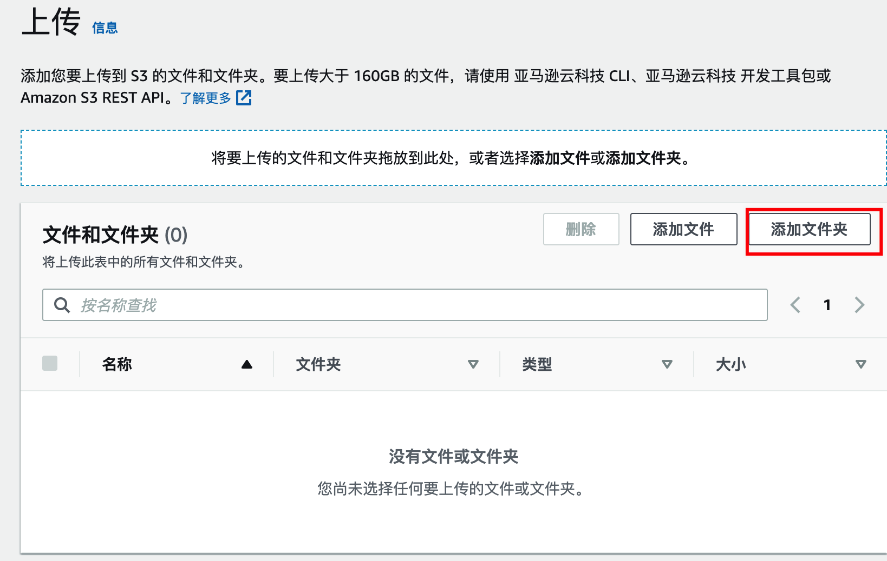
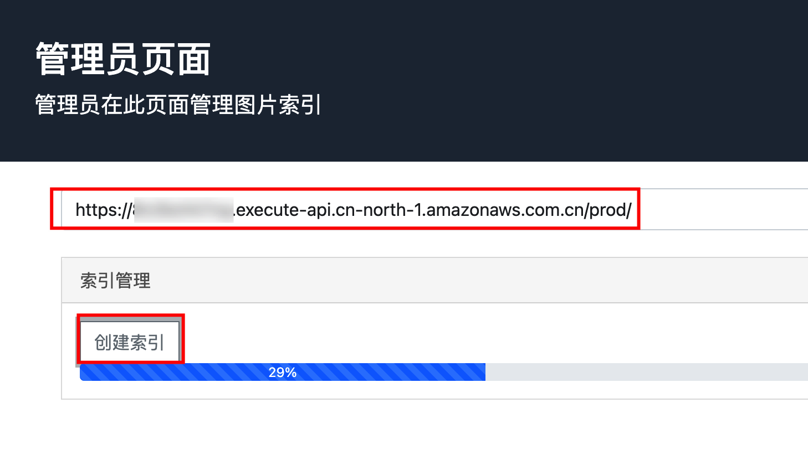

在本用例中，我们将使用来自FEIDEGGER的图像（FEIDEGGER是一套Zalando研究数据集），此数据集包含8792张图片，约200MB。
```
Citation:
@inproceedings{lefakis2018feidegger,
title={FEIDEGGER: A Multi-modal Corpus of Fashion Images and Descriptions in German},
author={Lefakis, Leonidas and Akbik, Alan and Vollgraf, Roland},
booktitle = { {LREC} 2018, 11th Language Resources and Evaluation Conference},
year = {2018}
}
```
## 下载数据集到本地
下载数据集需要使用python3，如果没有python3，请自行安装，参见：<https://www.python.org/downloads/>

下载[运行脚本](https://aws-gcr-solutions-workshop.s3.cn-northwest-1.amazonaws.com.cn/ai-solution-kit/v1.0.0/download.zip)，解压后运行以下命令进行下载数据集。下载数据集预计需要11分钟。
```
pip install tqdm
python3 download.py
```

## 上传数据集到S3
在进行此步骤前，需要确认4.2章节的堆栈已部署完毕。
把下载的图片上传到S3，s3为4.2章节中CloudFormation输出页签中s3Bucket的值。

**方式1，使用命令行(约3分钟)：**  
如果已配置访问密钥，使用命令行cd到下载数据集的目录下，然后运行  
`aws s3 sync ./ s3://{s3Bucket}`  


**方式2，使用亚马逊云科技web页面上传（约10分钟）：**  
在亚马逊云科技web控制台，进入{s3Bucket}存储桶，上传，选择添加文件夹，选择解压后的目录。

## 创建图片索引
用浏览器打开下载的示例程序前端文件admin.htm，在InvokeBaseUrl中填入4.2章节中CloudFormation输出页签中InvokeBaseUrl的值。
点击“创建索引”按钮，将发送请求到服务器端进行，此步预计需要5分钟，当进度条到达100%时表示创建索引完毕。

