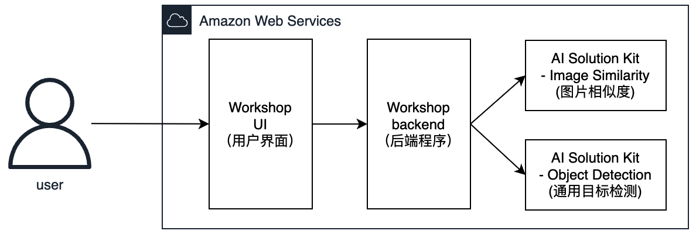
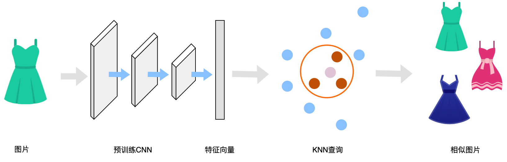
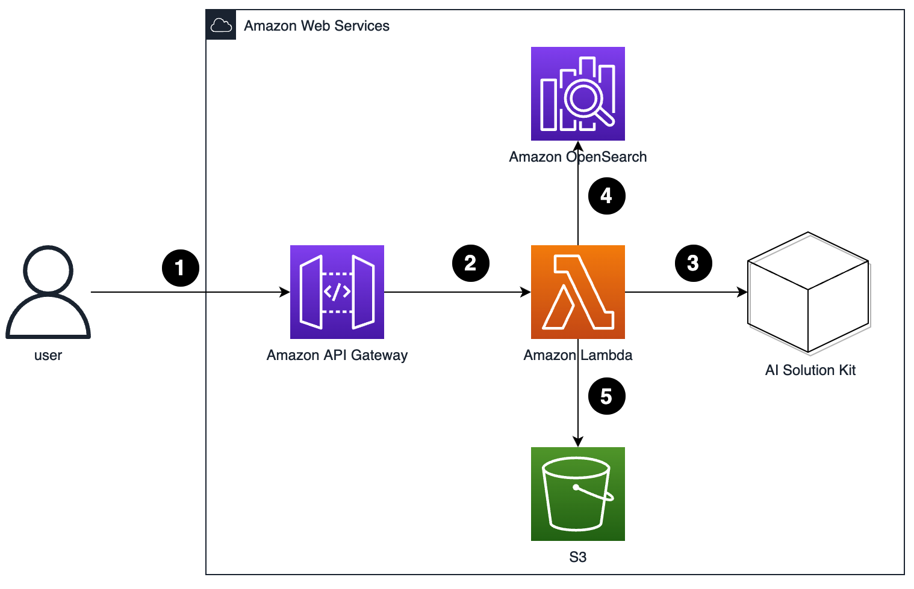
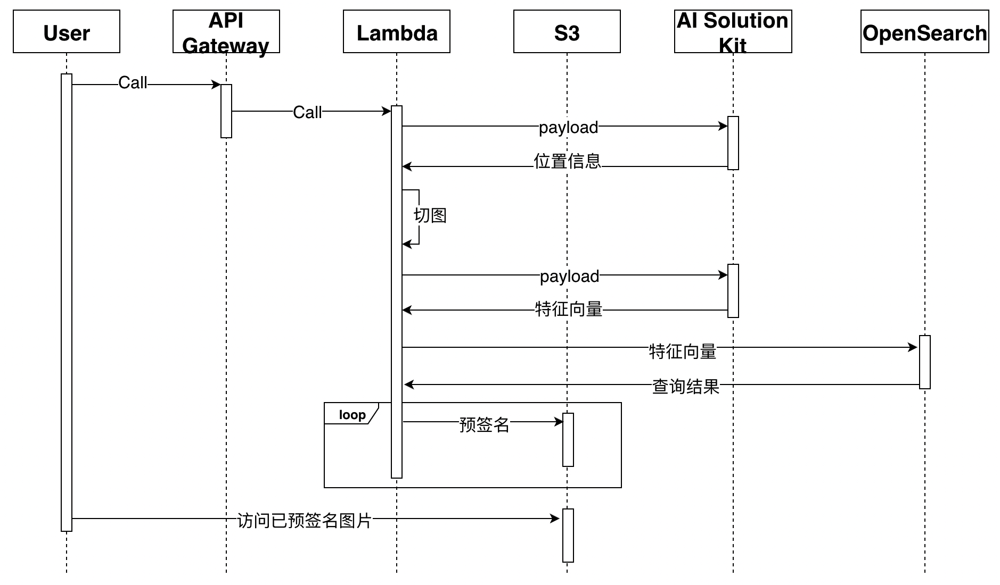

本次动手实验中，架构分为3个部分：  

1. AI Solution Kit  - 通用物体识别、图片相似度功能。提供核心AI 能力。
2. Workshop 前端程序 (Workshop UI) 
3. Workshop 后端程序（Workshop backend）

## AI Solution Kit架构
本方案利用了AI Solution Kit解决方案中的[通用物体识别](https://awslabs.github.io/aws-ai-solution-kit/zh/deploy-object-recognition/) (Object Detection)、[图片相似度](https://awslabs.github.io/aws-ai-solution-kit/zh/deploy-image-similarity/)（Image Similarity）。 

方案中提供了两种架构，基于Amazon Lambda的架构和基于Amazon SageMaker的架构。本动手实验是基于Lambda架构。对推理时效性要求较高的，在生产中可使用基于SageMaker版本。

具体架构请点击：<https://awslabs.github.io/aws-ai-solution-kit/zh/architecture/>

## Workshop架构
### 以图搜图原理

以图搜图需要先建立图片库（索引）。  
根据提供的图片，通过预训练模型，提取出若干个向量值，然后对待搜索图片也同样提取向量值，再进行k近邻（KNN）搜索，即可搜索到相似的图片。  
预训练模型和提取图片特征向量由AI Solution Kit提供，只需要向对应API提交图片信息即可。  
Amazon OpenSearch Service提供KNN搜索，能够在相似性用例中增强搜索能力。  
我们将AI Solution Kit和Amazon OpenSearch结合使用来实现以图搜图功能。  
### 平台/管理员创建索引

1. 管理员向API Gateway发送建立图片索引请求
2. API Gateway把信息转发给Lambda处理
3. Lambda遍历S3上图片
4. 把图片发送到AI Solution Kit，获取图片的特征向量。
5. 把返回的图片特征向量和图片位置信息作为一条item写入OpenSearch，生产中，可加入业务信息。
### 用户进行图片搜索

1. 用户向API Gateway发送待查询图片信息
2. API Gateway把信息转发给Lambda处理
3. Lambda把图片发送到AI Solution Kit，获取此图片的向量信息。
4. 根据返回的图片向量信息在OpenSearch中进行KNN查找。OpenSearch会返回若干个结果，结果中包含图片位置信息。
5. 根据图片位置信息对S3中图片进行预签名