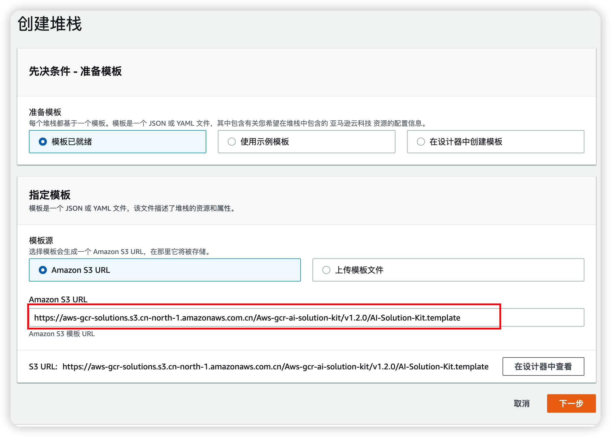
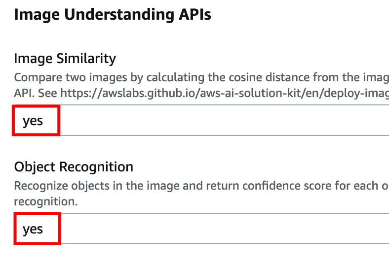
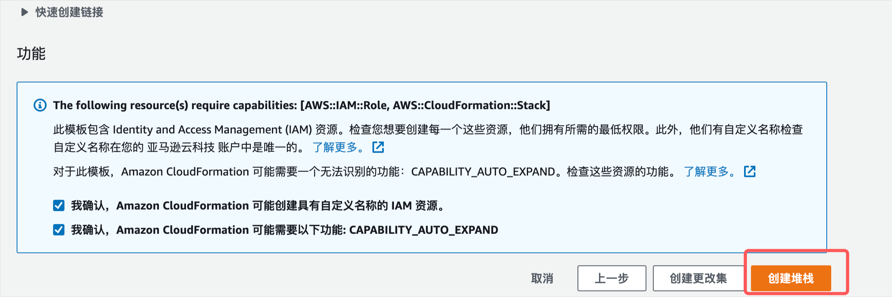

登陆亚马逊云科技控制台[中国区域](https://cn-north-1.console.amazonaws.cn/console)或[全球区域](https://us-east-1.console.aws.amazon.com/console/home)，
点击下表中的链接进入CloudFormation部署页面。

|区域|10GB版本(生产环境使用，速度快)|3GB版本(适用未提升lambda限额)|
|--|--|--|
|中国|[部署中国区域10GB版本](https://cn-north-1.console.amazonaws.cn/cloudformation/home?region=cn-north-1#/stacks/create/template?stackName=AI-Solution-Kit&templateURL=https://aws-gcr-solutions.s3.cn-north-1.amazonaws.com.cn/Aws-gcr-ai-solution-kit/v1.2.0/AI-Solution-Kit.template)|[部署中国区域3GB版本](https://cn-north-1.console.amazonaws.cn/cloudformation/home?region=cn-north-1#/stacks/create/template?stackName=AI-Solution-Kit&templateURL=https://aws-gcr-solutions.s3.cn-north-1.amazonaws.com.cn/Aws-gcr-ai-solution-kit/v1.2.0/AI-Solution-Kit-3G.template)|
|全球|[部署全球区域10GB版本](https://console.aws.amazon.com/cloudformation/home?region=us-east-1#/stacks/create/template?stackName=AI-Solution-Kit&templateURL=https://aws-gcr-solutions.s3.amazonaws.com/Aws-gcr-ai-solution-kit/v1.2.0/AI-Solution-Kit.template)|[部署全球区域3GB版本](https://console.aws.amazon.com/cloudformation/home?region=us-east-1#/stacks/create/template?stackName=AI-Solution-Kit&templateURL=https://aws-gcr-solutions.s3.amazonaws.com/Aws-gcr-ai-solution-kit/v1.2.0/AI-Solution-Kit-3G.template)|

在页面底部右下角选择**下一步**。

在**指定堆栈详细信息**页面的参数部分对API的部署进行配置。把图片相似度（Image Similarity）和对象检测（Object Recognition）的参数设置为“yes”，其他保持默认不变，在页面底部右下角选择**下一步**。

在**配置堆栈选项**页面，选择保留已成功预置的资源，其他保持默认，在页面底部右下角选择**下一步**。

在**审核**页面，查看并确认设置。在页面底部，确保选中确认模板将创建Amazon Identity and Access Management（IAM）资源的复选框。并确保选中Amazon CloudFormation需要的其它功能的复选框。选择右下角橙色**创建堆栈**按钮。

整个堆栈的创建过程预计将花费大约*五分钟*。可以在CloudFormation控制台的*状态*列中查看堆栈的状态。创建完成后即可看到状态为*CREATE_COMPLETE*。

堆栈创建成功后，您可以在AI Solution Kit的堆栈输出（Outputs）标签页中通过对应键查看基于Amazon API Gateway的调用URL。记录下**StagebaseURL**的值，后续实验会使用
