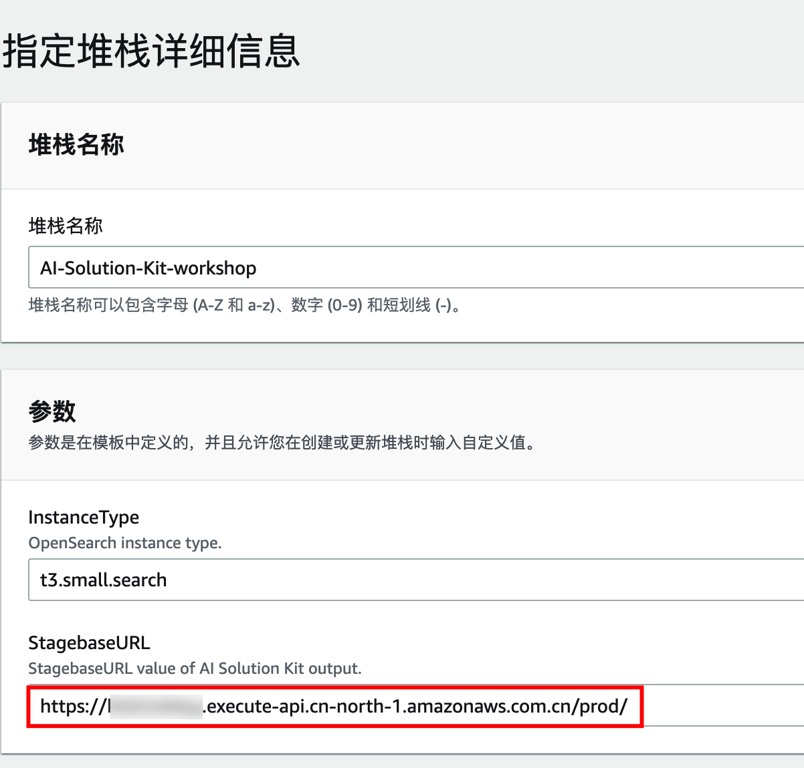
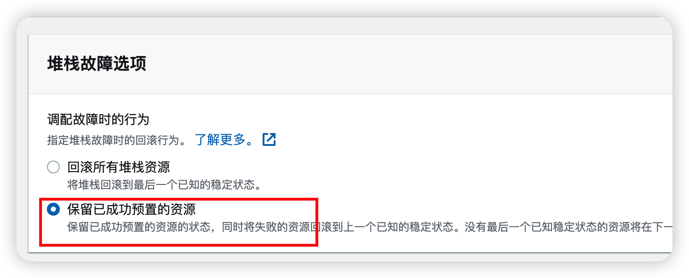
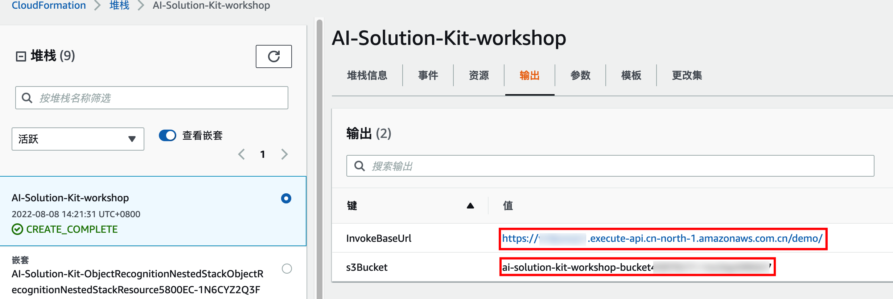

点击[链接](https://cn-north-1.console.amazonaws.cn/cloudformation/home?region=cn-north-1#/stacks/create/template?stackName=AI-Solution-Kit-workshop&templateURL=https://aws-gcr-solutions-workshop.s3.cn-northwest-1.amazonaws.com.cn/ai-solution-kit/v1.0.0/AI-Solution-Kit-workshop.template)进入部署页面，在页面底部右下角选择**下一步**。

在**指定堆栈详细信息**页面的参数部分，StagebaseURL参数请输入上一章节中部署CloudFormation的输出页签中StagebaseURL的值，其他保持默认不变，在页面底部右下角选择**下一步**。

在**配置堆栈选项**页面，选择保留已成功预置的资源，其他保持默认，在页面底部右下角选择**下一步**。

在**审核**页面，查看并确认设置。在页面底部，确保选中“我确认，Amazon CloudFormation可能创建IAM资源”。选择右下角橙色**创建堆栈**按钮。

启动部署后，不需要等待，在第5章管理员上传图片前确认此步骤完成即可。部署需要大约15分钟。后续会用到此堆栈的输出值，点击“输出”页签，可查看对应的输出值。
