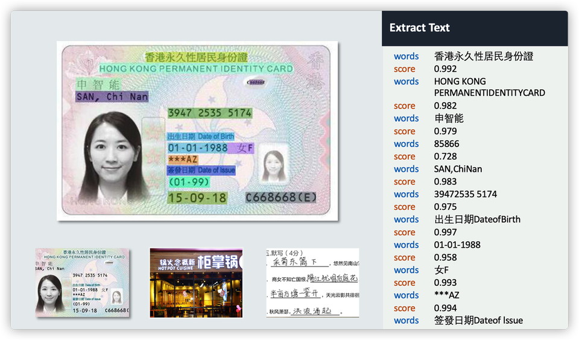

# Chinese OCR

## Description

The Chinese OCR solution based on AI/ML text recognition technologies, it can automatically extract the text in all kinds of pictures, and returns the text results and the coordinate positions of text in the pictures. The OCR feature supports several languages, Simplified/Traditional Chinese, English and Numbers. This solution also enhances the processing and recognition of large character sets, like the Hong Kong Supplementary Character Set (HKSCS). It can be used to process documents in medical, finance, education and other industries, effectively reducing costs and improving efficiency.

## Deployment

```
# Require to install AWS CDK
$ cdk deploy AIKits-Infer-OCR-Stack
```

### Parameters

This solution uses the following default values, you can modify them as necessary.

|  Parameter   |  Default |  Description |
|  ----------  | ---------| -----------  |
| **customStageName**  | prod | The name of the stage, which API Gateway uses as the first path segment in the invoked Uniform Resource Identifier (URI).|
| **customAuthType**    | AWS_IAM    | Authorization for API Gateway. Valid Values are *AWS_IAM* and *NONE*. |

### Outputs

|  Name   |  Description |
|  -------|  ----------- |
| **aikits InvokeURL**  | REST API invoke URL. |
| **aikits InvokeURLArn** | REST API ARN. |

## Get Started

### Invoking URL

You can see the URL of the record prefixed with **aikitsInvokeURL** in the Outputs tab of Amazon CloudFormation.

### REST API Reference

- HTTP Method: `POST`

- Body Parameters

| **Name**  | **Type**  | **Optional** |  **Description**  |
|----------|-----------|------------|------------|
|url&nbsp;&nbsp;&nbsp;&nbsp;       |*String*     |Use *img* or *url* | URL address of the image. Supports HTTP/HTTPS and S3 protocols. Required image format jpg / jpeg / png / bmp, not exceeding the longest side 4096px.|
|img       |*String*     |Use *img* or *url*|Base64-encoded image data|

- Sample Request Body 

``` json
{
  "url": "https://aikits.demo.solutions.aws.a2z.org.cn/img/ocr-2.jpg"
}
```

``` json
{
  "img": "/9j/4AAQSkZJRgABAQEAYABgAAD/2wBDAAgGBgcGBQgHBwcJCQgKDBQNDAsLDBkSEw8UHRofHh0aHBwgJC4nICIsIxwcKDcpLDAxNDQ0Hyc5PTgyPC4zNDL/……"
}
```

- Response Prarameters

| **Name**  | **Type**  |  **Description**  |
|----------|-----------|------------|
|words    |*String*   |Identify text content |
|location |*JSON*     |Recognized text in the image coordinate values, including top, left, width, height integer value|
|score    |*Float*   |The confidence of the recognized text|

- Sample Response
``` json
[
    {
        "words": "香港永久性居民身份證",
        "location": {
            "top": 18,
            "left": 148,
            "width": 169,
            "height": 17
        },
        "score": 0.9923796653747559
    },
    {
        "words": "HONG KONG PERMANENTIDENTITYCARD",
        "location": {
            "top": 36,
            "left": 71,
            "width": 321,
            "height": 17
        },
        "score": 0.9825196266174316
    }

]
```





###  Sample Request Code

**cURL**
``` bash
curl --location --request POST 'https://xxxxxxxxxxx.execute-api.xxxxxxxxx.amazonaws.com/prod/ocr' \
--header 'Content-Type: application/json' \
--data-raw '{
  "url":"https://aikits.demo.solutions.aws.a2z.org.cn/img/ocr-2.jpg"
}'
```

**Python (requests)**
``` python
import requests
import json

url = "https://xxxxxxxxxxx.execute-api.xxxxxxxxx.amazonaws.com/prod/ocr"

payload = json.dumps({
  "url": "https://aikits.demo.solutions.aws.a2z.org.cn/img/ocr-2.jpg"
})
headers = {
  'Content-Type': 'application/json'
}

response = requests.request("POST", url, headers=headers, data=payload)

print(response.text)

```

**Java (OkHttp)**
``` java
OkHttpClient client = new OkHttpClient().newBuilder()
  .build();
MediaType mediaType = MediaType.parse("application/json");
RequestBody body = RequestBody.create(mediaType, "{\n  \"url\":\"https://aikits.demo.solutions.aws.a2z.org.cn/img/ocr-2.jpg\"\n}");
Request request = new Request.Builder()
  .url("https://xxxxxxxxxxx.execute-api.xxxxxxxxx.amazonaws.com/prod/ocr")
  .method("POST", body)
  .addHeader("Content-Type", "application/json")
  .build();
Response response = client.newCall(request).execute();
```

**PHP (curl)**
``` php
<?php

$curl = curl_init();

curl_setopt_array($curl, array(
  CURLOPT_URL => 'https://xxxxxxxxxxx.execute-api.xxxxxxxxx.amazonaws.com/prod/ocr',
  CURLOPT_RETURNTRANSFER => true,
  CURLOPT_ENCODING => '',
  CURLOPT_MAXREDIRS => 10,
  CURLOPT_TIMEOUT => 0,
  CURLOPT_FOLLOWLOCATION => true,
  CURLOPT_HTTP_VERSION => CURL_HTTP_VERSION_1_1,
  CURLOPT_CUSTOMREQUEST => 'POST',
  CURLOPT_POSTFIELDS =>'{
  "url":"https://aikits.demo.solutions.aws.a2z.org.cn/img/ocr-2.jpg"
}',
  CURLOPT_HTTPHEADER => array(
    'Content-Type: application/json'
  ),
));

$response = curl_exec($curl);

curl_close($curl);
echo $response;
```

## License

This project is licensed under the Apache-2.0 License.